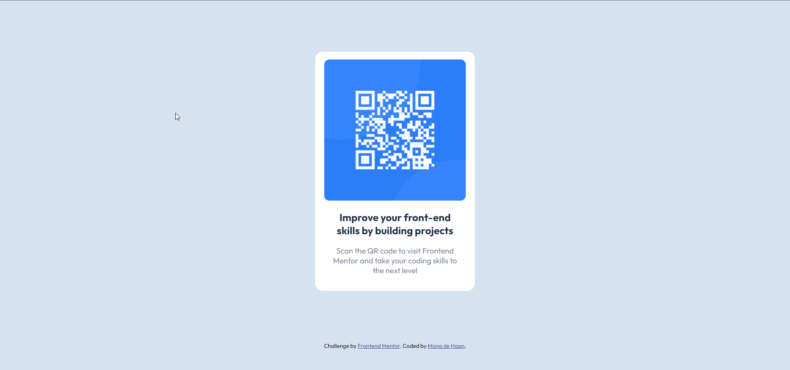

# Frontend Mentor - QR code component solution

This is a solution to the [QR code component challenge on Frontend Mentor](https://www.frontendmentor.io/challenges/qr-code-component-iux_sIO_H). Frontend Mentor challenges help you improve your coding skills by building realistic projects. 

## Table of contents

- [Overview](#overview)
  - [Screenshot](#screenshot)
  - [Links](#links)
- [My process](#my-process)
  - [Built with](#built-with)
  - [What I learned](#what-i-learned)
  - [Continued development](#continued-development)
- [Author](#author)

**Note: Delete this note and update the table of contents based on what sections you keep.**

## Overview

### Screenshot

### Links

- Live Site URL: https://monascape.github.io/QR-Code-FrontEnd-Mentor-Challenge/

## My process

### Built with

- Semantic HTML5 markup
- CSS custom properties

### What I learned

How to make rounded borders using border radius purely using CSS.

### Continued development

Improve the coding and perhaps redo it using a framework to make it easier and more responsive.

## Author

- LinkedIn - [Monalisa](https://www.linkedin.com/in/monascape/)
- Frontend Mentor - [@monascape](https://www.frontendmentor.io/profile/monascape)
- Twitter - [@monascape](https://www.twitter.com/monascape)

